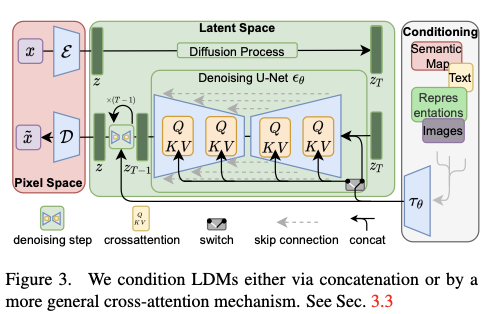
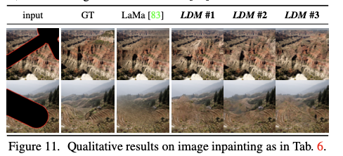

# 論文読解メモ

対象論文: [High-Resolution Image Synthesis with Latent Diffusion Models](https://arxiv.org/abs/2112.10752)

著者: Robin Rombach, Andreas Blattmann, Dominik Lorenz, Patrick Esser Bjo ̈rn Ommer

著者の所属機関: 

- Ludwig Maximilian University of Munich & IWR Heidelberg University

- Germany Runway ML

## 論文要約

- 潜在空間上で画像生成(再構成)を行うことができるLatent Diffusion Model(LDM)を提案。
- 従来手法は画像生成プロセスをピクセル空間で生成しており知覚的に冗長かつ、計算負荷が高かった。
  - 150～1000day(train)@V100, 5day(inference)@V100
- 学習プロセスを圧縮学習と生成学習に分け、潜在空間上で画像生成を行うことで、
  従来手法より学習時の計算量を大幅に削減。
- Cross-Attnを用いた汎用的な条件付け機構を導入しマルチモーダルな学習が可能にした。
- 複数タスクにおいて、SoTAモデルのスコアを更新。
  - 条件なし画像合成, セマンティックシーン合成, 画像インペインティング

## Motivationと背景

- 現在の拡散モデル(DMs)は非常に多くの計算コストがかかっている
  このことは、一部機関のみが拡散モデルを研究可能である状況を招き、分野全体の発展を阻害している。
- DMの詳細分析によると**知覚的圧縮(Perceptual Compression)**と**意味的圧縮(Semantic Compression)**に分けることができる
- 知覚的圧縮した潜在空間でDiffusion Processを行うことで計算量を圧縮して、広範囲に誰でも使えるようにしたい。

## モデル概要

- 赤枠部分で実画像を知覚的圧縮を行い、これを潜在空間の特徴に圧縮する。
  さらにこの後、Diffusion Processで意味的圧縮を行い、最終的な特徴量を得る。

- Conditionning部は、実画像とペアで与えられた条件(text, image, semanticMap等)を既存のAutoEncoderを用いて特徴抽出する。
  
- DenoisingブロックはConditioning部で得た条件の特徴量と, 潜在特徴をCross-Attnで結合しAttentionを得る。

- LDMで学習対象となるのは、Attentionの重み付け部のみ(?)

###  モデルの定義式

  - 実画像から潜在空間への知覚的圧縮

$$
\large L_{LDM} = \mathbb{E}_{x, \epsilon \textasciitilde \mathcal{N}(0, 1), t} \
  	\lbrack \lVert \epsilon - \epsilon_\theta(x_t, t) \rVert ^2_2 \rbrack
$$

  - 潜在空間から意味的圧縮

$$
\large L_{LDM} := \mathbb{E}_{\mathcal{E}(x), \epsilon \textasciitilde \mathcal{N}(0, 1), t} \
  \lbrack \lVert \epsilon - \epsilon_\theta(z_t, t) \rVert ^2_2 \rbrack
$$

  

  - 条件付け器を含めた最終的なモデル

$$
\large L_{LDM} := \mathbb{E}_{x, y, \epsilon \textasciitilde \mathcal{N}(0, 1), t} \
  	\lbrack \lVert \epsilon - \epsilon_\theta(z_t, t, \tau_\theta(y)) \rVert ^2_2 \rbrack
$$

  - $x$: 入力画像, $\tilde{x}$: 復号された生成画像, $x_t$: ノイズを付加された各画像
  - $\epsilon$: 学習するNNのバックボーン(?)
  - $\epsilon_\theta$: ノイズ除去オートエンコーダ(U-Net)
  - $z$: は$\mathcal{E}$により圧縮された潜在特徴
  - $y$: 条件付け器に入力する条件(text, image, semantic-map)
  - $\tau_\theta$: 各ドメイン特有のエンコーダ 
    - Text-to-Image: BERT-Tokenizerを用いて実装
  - $\epsilon_\theta$と$\tau_\theta$は学習時に合同で最適化される

- 条件付機構のCross-Attention計算

$$
Attention(Q, K, V) = softmax(\frac{QK^T}{\sqrt{d}}) \\
  Q = W^{(i)}_{Q} \cdot \varphi_i(z_t), \
  K= W^{(i)}_{K} \cdot \tau_\theta(y), \
  V = W^{(i)}_{V} \cdot \tau_\theta(y)
$$

  - $ \varphi_i(z_t) \in \mathbb{R}^{N \times d^i_\epsilon} \\ $はUNetの平坦化された中間表現

## 実験結果

### 画像生成の結果

- **<u>訓練stepと評価指標</u>**(ダウンサンプリングファクター$f$ごと)
  - ダウンサンプリングファクター$f$の圧縮が弱すぎたり、強すぎるとFIDスコアが早期に停滞する
  - LDM4-16が生成品質と推論速度のバランスが良い

- 推論速度とサンプル品質の比較(L: CelebHQ-A, R: ImageNet)

  - LDM4-16がサンプル速度と生成品質のバランスが良い。
  
  

- oursは既存モデル(DALL-E, VQGAN)と比較して, FIDを優位に低くでき、かつ画像の細部が破綻していないことがわかる。

- 既存モデル(VQGAN, DALL-E)と比較して、いずれのメトリクスでも改善が見られる。
  - ただし、PSIM, SSIMは改善幅が小さい。
  - これは、PSIMとSSIMが人間の体感的な感覚と合致していないためで、問題ないとの主張。
    (PSIM, SSIMが高い生成画像は、人間が見るとぼやているらしい)

### 条件付き生成の品質

- 既存手法であるVQGAN+T, ImageBARTと比較して、FIDが優位に低くなっている。
  - ただし、ISではImageBARTに負けている。

- スループットが約45%改善しており、サンプル処理時間も早くなっていることがわかる。

  

- ぱっと見はそれらしい画像が生成されているように見えるが、よく細部を確認すると依然として不自然。

### 超解像性能の実験結果

- 
- 64px to 256px の超解像度性能は、定量的性能ではFIDのみ既存手法のSR3を凌駕している

- 条件づけの際に, 特定方式(bicubic)のみを採用したLDM-SRモデルは、超解像の精度が落ちている
- もう少し汎用性を増すために、ref. 98に従って様々なdegradation processを採用したLDM-BSRでは、主観的に良い結果が得られている。

### Impating性能の結果

- 全体としてピクセルベースと潜在ベースの拡散モデルの間で少なくとも2.7倍のスピードアップ

- 同時にFIDスコアは少なくとも1.6倍向上していることが確認された。

## 新規性・進歩性

- Diffusion Modelを分析のうえ、知覚的圧縮と意味的圧縮に分け、潜在空間でDiffusion Processを行ったこと。
  - これにより、学習時の計算量を大幅に削減することができた。
  - これにより、人の知覚に近い特徴空間が学習可能であることを示したこと。
- Cross-Attnを用いた汎用的な条件付け機構を導入し、マルチモーダルな学習を可能にしたこと。
  - これにより、タスクに特化したアーキテクチャを用いずに、広範囲の条件付き画像合成タスクにおいて、既存手法より良好な結果を示したこと。
  - 特に条件付け器にセマンティックマップを入力、レイアウトを指示した画像生成を可能にしたこと。

## 残課題

- 超解像タスクでは、既存手法(SR3)を上回る効果は確認されなかった。
- 画像細部の生成については、未だ不自然であり、高精度な画像が必要なタスクへの利用は不向き。

## 参考資料

- [論文解説 Latent Diffusion Model](https://speakerdeck.com/koharite/lun-wen-jie-shuo-latent-diffusion-model?slide=16)
- [論文まとめ：High-Resolution Image Synthesis with Latent Diffusion Models](https://blog.shikoan.com/latent-diffusion)

## 考察

###  学んだこと

- LDMの大まかな構成と仕組みがわかった。
- BBXやセグメンテーションマップのような形式を入力できることは知らなかった
  - ControlNetとの違いが知りたい
- 生成モデルの評価指標を知ることができた。
  - [Inception Score](https://data-analytics.fun/2021/12/12/understanding-inception-score/)
  - [FID(Frechet Inception Distance)](https://data-analytics.fun/2021/12/31/understanding-fid/)

###  不明点・よくわからんかったポイント

- 全体的に学習プロセス理解が未だに曖昧。
  - タスク条件付け部分のCross-Attn実装に関して、理解が曖昧。
  - Cross-AttentionをUNetの中間レイヤに結合する際の詳細な実装

- 従来手法のVanillaなDiffusion Modelに関する理解が不足している為であると考える。

##  実務への活かし方

- 既存の画像分析系タスクを処理するAIモデルでの利用方法が考えられる。具体的には以下のような例に有用かもしれない。

  - AIモデルの品質保証を目的に、セマンティックシーン合成によりテストデータを生成する。

  - 改善用データ生成(精度劣化要因とするシーンが明らかになっている場合のみ有用)
- クラウド上での活用はできると考えられるが、
- 最近になって、XBox上でStable Diffusionの推論を行うツール(https://github.com/axodox/axodox-machinelearning)が登場している。
  - 上手な利用方法が考案できれば、車両内にデプロイされたモデルを改善するために動的データ生成が行えるかもしれない。

## 次に読む資料

- [Denoising Diffusion Probabilistic Models](https://arxiv.org/abs/2006.11239)
- https://atcold.github.io/pytorch-Deep-Learning/ja/week12/12-3/
- [Adding Conditional Control to Text-to-Image Diffusion Models](https://arxiv.org/abs/2302.05543)

## 次にやること

- [A Toy Diffusion model you can run on your laptop](https://medium.com/mlearning-ai/a-toy-diffusion-model-you-can-run-on-your-laptop-20e9e5a83462)を用いて、詳細なDMの実装理解を進める。

- 本論文のAppendixを参照し、詳細な学習プロセスの理解を深める。

- 評価指標(FID, IS)について詳細調査し、その内容をまとめる。

以上
